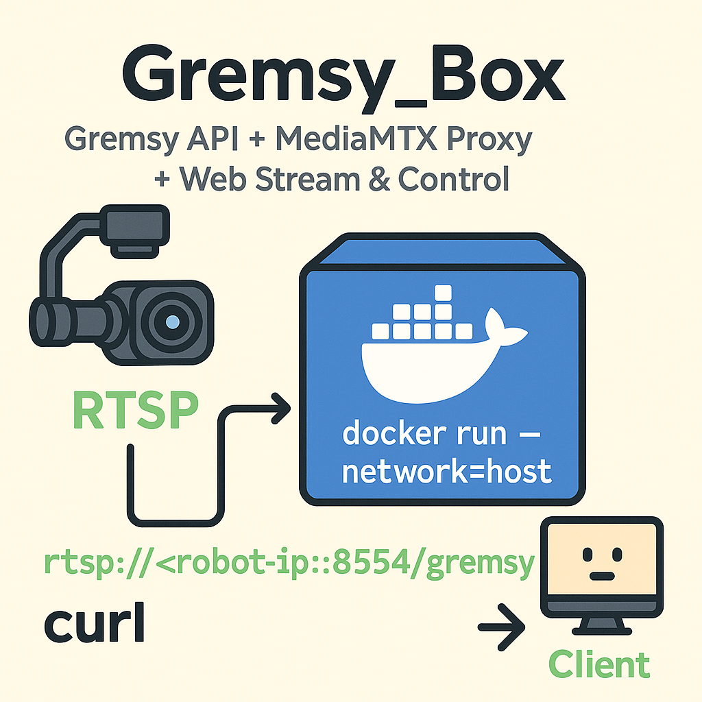

# Gremsy_Box




<!-- width만 지정 -->
<!--  -->

<!-- width와 height 모두 지정 -->
<!--  -->

<!-- CSS 스타일로 더 세밀하게 지정 -->


**Gremsy API + MediaMTX Proxy + Web Stream & Control**

---


## 📦 MediaMTX Docker 실행

### 기본 실행

```bash
docker run --rm -it --network=host bluenviron/mediamtx:latest
````

> ⚠️ RTSP 스트리밍을 위해 `--network=host` 플래그가 필요합니다.
> Docker가 UDP 패킷의 소스 포트를 변경할 수 있어, 서버가 클라이언트를 식별하지 못할 수 있습니다.

---

### `--network=host` 옵션을 사용할 수 없는 경우

RTSP UDP 전송 프로토콜을 비활성화하고 서버 IP를 추가하고 MTX_WEBRTCADDITIONALHOSTS포트를 수동으로 노출할 수 있습니다.

(Windows, Kubernetes 등)

```bash
docker run --rm -it \
  -e MTX_RTSPTRANSPORTS=tcp \
  -e MTX_WEBRTCADDITIONALHOSTS=192.168.x.x \
  -p 554:8554 \
  -p 1935:1935 \
  -p 8888:8888 \
  -p 8889:8889 \
  -p 8890:8890/udp \ #이미 로봇에서 쓰는중.
  -p 8189:8189/udp \
  bluenviron/mediamtx
```

---

## ▶️ Proxy 설정

`start_mediamtx.sh` 스크립트를 통해 MediaMTX를 실행하고, RTSP 스트림을 프록시합니다:

```bash
./start_mediamtx.sh
```

---

## ⚙️ 설정 파일 (`mediamtx.yml`)

* 위 설정을 적용하면 아래 스트림으로 접근할 수 있습니다.

  ```
    rtsp   : rtsp://robot-ip:8554/gremsy/
    webrtc : http://robot-ip:8889/gremsy/
  ```

---

## 🔍 스트림 확인 (curl)

1. **RTSP DESCRIBE 요청**
   RTSP 핸드셰이크 확인용:

   ```bash
   curl -v rtsp://<robot-ip>:8554/gremsy
   ```

2. **MediaMTX HTTP API**
   등록된 경로 확인:

   ```bash
   curl http://<robot-ip>:8888/api/paths
   ```

### 로봇 남는 포트 확인

```bash
netstat -al | grep 8887
```

ui폴더에 진입
## 도커 설치 (하버 활용)

```bash
docker pull docker.argusvision.io/gremsy/gremsy_ui@sha256:45f2f2fa922ab22deb8694c948ff3426241199cc7ec89356c9f4525436ffffcc
```


```bash
docker build -t gremsy-ui:v0.2.0 .

# 실행
docker run --rm -it --network=host gremsy-ui:v0.2.0
```

## 클라이언트 실행

웹페이지에 아래 URL로 접속

```url
<robot-ip>:7777
```

## API 포트 설정 

docker -e option으로 조절

```bash
docker run -d --restart unless-stopped \
  --name gremsy_api_autorun\
  --network host \
  -e PORT=8003 \
  gremsy_api:v0.3.0
```